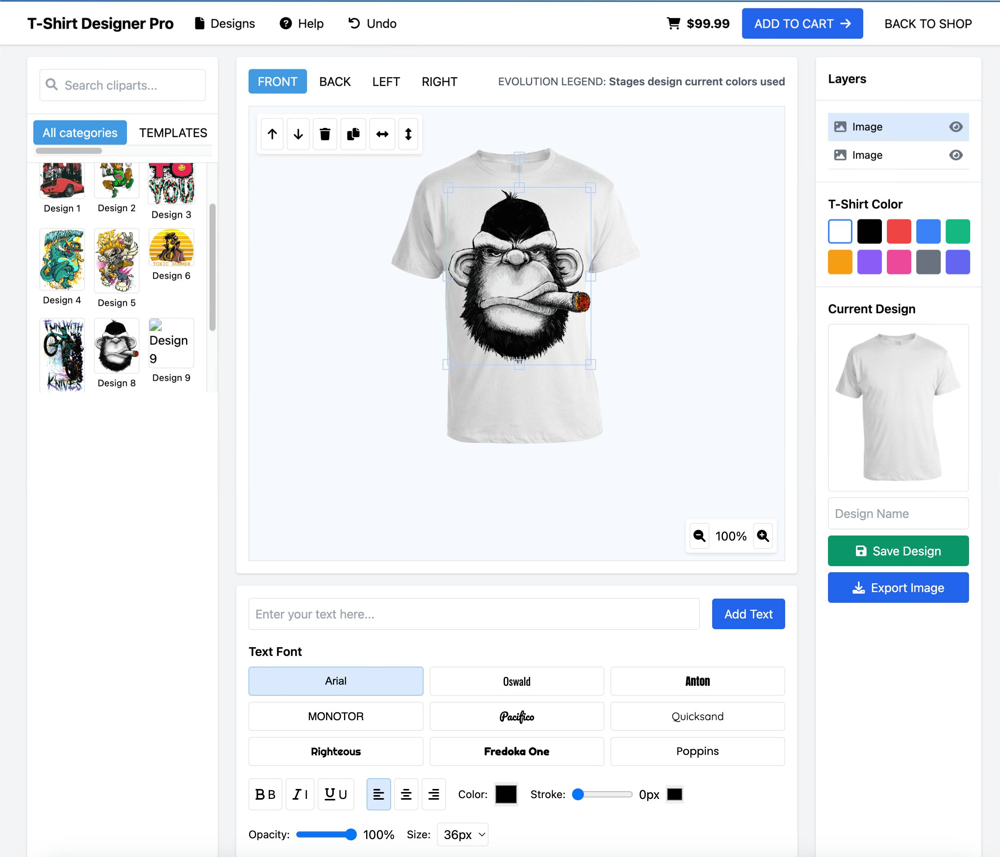

# T-Shirt Designer Web Application

## Overview
This is a comprehensive T-Shirt design tool built with Laravel, Fabric.js, and jQuery. The application allows users to:

- Design custom t-shirts with multiple views (front, back, left, right)
- Add text with various fonts and styling options
- Apply design elements from a clipart library
- Change t-shirt colors dynamically
- Save and export designs

## Features
- 🎨 Multi-view design (front, back, left, right)
- 🌈 Dynamic color changing
- ✏️ Text styling with various fonts
- 🖼️ Clipart library
- 💾 Save/load designs
- 📤 Export as PNG

## Installation
1. Clone repository:
```bash
git clone https://github.com/your-repo/tshirt-designer.git
cd tshirt-designer
```

2. install dependencies:
```bash
composer install
npm install
```


3. Configure environment:
```bash
cp .env.example .env
php artisan key:generate
```


4. Set up database:
```bash
php artisan migrate
```

5. Build assets:
```bash
npm run dev
```


6. Run application:
```bash
php artisan serve
```


### File Structure

```bash
public/images/
  ├── tshirt-front-[color].png
  ├── tshirt-back-[color].png
  └── designs/
resources/views/designer.blade.php
routes/web.php
```

### Support

For issues, contact: a.bakar87@gmail.com, Mobile: +8801758083458

### License
MIT License